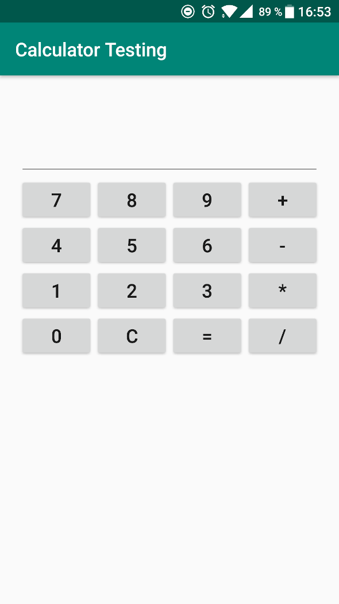

# Calculator app to implement testing feature

### Languages, pattern and libraries used
- [Kotlin](https://kotlinlang.org/)
- [Clean Architecture](http://blog.cleancoder.com/uncle-bob/2012/08/13/the-clean-architecture.html)
- [MVVM](https://developer.android.com/topic/libraries/architecture/viewmodel)
- [Koin](https://github.com/InsertKoinIO/koin)
- [RxJava2](https://github.com/ReactiveX/RxJava/wiki/What's-different-in-2.0)
- [LiveData](https://developer.android.com/topic/libraries/architecture/livedata)
- [JUnit](https://junit.org/junit5/)
- [Mockito](https://site.mockito.org/)
- [Espresso](https://developer.android.com/training/testing/espresso)
- [Robolectric](http://robolectric.org/)

## License

    Copyright 2019 Daniel Ávila Domingo

    Licensed under the Apache License, Version 2.0 (the "License");
    you may not use this file except in compliance with the License.
    You may obtain a copy of the License at

        http://www.apache.org/licenses/LICENSE-2.0

    Unless required by applicable law or agreed to in writing, software
    distributed under the License is distributed on an "AS IS" BASIS,
    WITHOUT WARRANTIES OR CONDITIONS OF ANY KIND, either express or implied.
    See the License for the specific language governing permissions and
    limitations under the License.
    
